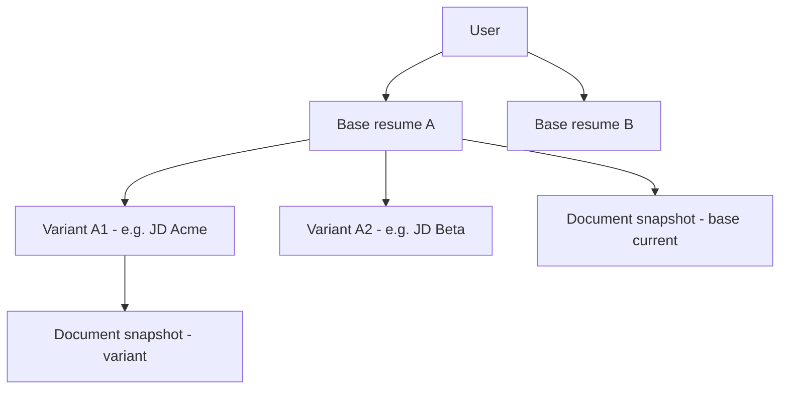

# Versioning model — Checkpoint 0.3

**Status:** Locked for v1  
**Related:** [PRODUCT_ONEPAGER.md](./PRODUCT_ONEPAGER.md) (0.1), [TEMPLATE_CONTRACT.md](./TEMPLATE_CONTRACT.md) (0.2)

This document defines **who owns what**, **how many “résumés” a user has**, and **what happens when they tailor for a job**—so product, API, and agent runtime stay aligned.

---

## 1. Hierarchy (one picture)

- A **user** has **zero or more base résumés**.
- Each **base résumé** has exactly **one “current” canonical document** at a time (the editable line that drives the Jake PDF for that base).
- Each **variant** is a **separate branch** off one base: it has its **own** document snapshot (and PDF lineage), not a second base.

---

## 2. Definitions

| Term | Meaning |
|------|--------|
| **User** | Authenticated account. Owns bases and (indirectly) variants. |
| **Base résumé** | One “master story” for a target profile (e.g. “SWE general”, “ML research”). Created after **import** or **guided build**. Has a user-facing **title**, `template_id` (v1: single template), and **one active `ResumeDocument`**. |
| **ResumeDocument** | Versioned or latest **structured payload** that conforms to [TEMPLATE_CONTRACT.md](./TEMPLATE_CONTRACT.md). This is what renders to LaTeX/PDF. |
| **Variant** | A **JD-targeted copy** of a base: forked structured document + optional metadata (company name, JD hash, notes). Used for rephrasing / emphasis without overwriting the base. |
| **User profile / superset** | Cross-cutting store for **overflow** and stable prefs (see 0.2). **Not** a “base” and **not** a variant—it attaches to the **user** (and may be linked when importing into a specific base). |

---

## 3. Fork vs edit in place

| Action | What it touches | When to use |
|--------|------------------|-------------|
| **Edit in place** | Updates the **current `ResumeDocument`** for the **base** (or for the **variant** if the user is inside that variant’s editor). Same entity ID or new row as “latest version” of the same base/variant. | Chat edits, recommendations applied while staying on “this résumé.” |
| **Fork (create variant)** | **Copies** the base’s current `ResumeDocument` into a **new variant** with a new ID. Base document **unchanged**. Subsequent edits apply only to the variant unless user switches context. | User pastes a JD and wants an **Acme-specific** copy; A/B comparisons; “keep my general base clean.” |

**Rules**

1. **Variants never auto-merge back** into the base without an explicit user action (future: “Promote changes to base” is out of v1 unless specified later).
2. **Deleting a base** cascades (policy): either **delete all variants** under it or **block delete** until variants are removed—pick one in implementation and document in API.
3. **Renaming** only affects display metadata (`title`, variant label), not template contract.

---

## 4. UI naming (user-facing copy)

| Internal | Suggested user label | Notes |
|----------|---------------------|--------|
| Base résumé | **“Base résumé”** or **“Master”** | Avoid “project” or “file” alone—confusing vs variant. |
| Variant | **“Copy for [Company]”** or **“Job version”** | Default name can be company + date from JD parse. |
| Create variant | **“New version for a job”** / **“Tailor for this job”** | Makes clear it’s a fork, not a new base. |
| Switch context | Picker: **base** vs list of **variants** under that base | User must always know which line they’re editing. |

**Anti-patterns:** Calling both bases and variants “résumé” with no qualifier; implying variants “sync” with the base automatically.

---

## 5. Suggested persistence fields (logical)

**Base résumé**

- `id`, `user_id`, `title`, `created_at`, `updated_at`
- `source`: `import` | `guided`
- `active_document_id` → current `ResumeDocument` for this base

**Variant**

- `id`, `base_resume_id`, `label` (user or default)
- `forked_from_document_id` (optional audit) or `forked_at`
- `jd_text_ref` / blob pointer / hash (optional)
- `active_document_id` → current `ResumeDocument` for this variant

**ResumeDocument**

- `id`, `owner_type`: `base` | `variant`, `owner_id`
- `schema_version`, `payload` (JSON), `created_at`
- Optional: `parent_document_id` if you store explicit lineage on fork

**Agent thread (recommended)**

- Bind **one conversation thread** per **editing context**: either a `base_resume_id` or `variant_id`, never ambiguous.
- New variant **may** start a new thread (cleaner) or inherit with a system message (“You are now editing the Acme variant”)—product choice; if inherited, still store `context = variant_id` on each run.

---

## 6. JD flow (ties to 0.3)

1. User is on a **base** (or already on a variant).
2. User chooses **“Tailor for a job”** → provides JD → system **forks** → new **variant** + optional research.
3. All agent edits in that session target **variant’s** `ResumeDocument` until user switches back to base.

---

## 7. Checklist (0.3 done when)

- [ ] API and DB names match **base / variant / document** above (or a mapping table in code).
- [ ] UI always shows **which context** is active (base vs which variant).
- [ ] “Fork” and “edit in place” are implemented per §3; no silent cross-write between base and variant.
- [ ] Metrics from one-pager can be computed: **variants per base**, bases per user.

---

## Document control

| Version | Date | Notes |
|---------|------|--------|
| 0.1 | 2026-04-30 | Checkpoint 0.3 initial lock |
